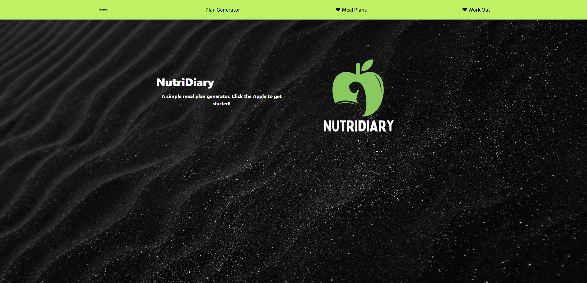

# NutriDiary

## [Link to Deployed page](https://meanbean87.github.io/ucb-project-one/).

## Description

The Meal Planner MVP is a web application that helps users plan their meals based on their Total Daily Energy Expenditure (TDEE) and Basal Metabolic Rate (BMR). The TDEE represents the total number of calories a person needs to consume in a day to maintain their current weight, taking into account their activity level. The BMR, on the other hand, represents the number of calories required to sustain basic bodily functions at rest.

By inputting their age, height, weight, gender and activity level, users can obtain personalized meal plans that align with their daily caloric allowances. The meal plans consist of recipes that are carefully selected to meet the nutritional needs and calorie goals of the users. The application aims to provide users with a convenient and efficient way to plan their meals while promoting a balanced and healthy diet.

The Meal Planner MVP utilizes an algorithm that considers various factors such as macronutrient distribution, portion sizes, and meal frequency to create optimized meal plans.

The web application provides an intuitive and user-friendly interface where users can input their values. After submitting the information, the application generates a list of options consisting of either breakfast, lunch, dinner, and snacks. Each meal includes a link to the recipes with detailed instructions and nutritional information.

The Meal Planner MVP aims to simplify the meal planning process and help users make informed choices about their daily nutrition. It provides a foundation for further development, allowing for potential enhancements such as user registration, saving and tracking meal plans. This project was made during the Full Stack Web Development Bootcamp and UC-Berkley Extension.



## Technology Used

| Technology   | Badge                                                                     | Documentation                                                                       |
| ------------ | ------------------------------------------------------------------------- | ----------------------------------------------------------------------------------- |
| HTML         |                          | [HTML Documentation](https://developer.mozilla.org/en-US/docs/Web/HTML)                |
| CSS          |                              | [CSS Documentation](https://developer.mozilla.org/en-US/docs/Web/CSS)                  |
| JavaScript   |            | [JavaScript Documentation](https://developer.mozilla.org/en-US/docs/Web/JavaScript)    |
| Git          |                    | [Git Documentation](https://git-scm.com/)                                              |
| Google Fonts |  | [Google Fonts Documentation](https://developers.google.com/fonts/docs/getting_started) |
| Animate.css  |   | [Animate.css Documentation](https://animate.style/)                                    |
| Tailwind CSS |     | [Tailwind CSS Documentation](https://tailwindcss.com/docs)                             |
| Chart.js     |              | [Chart.js Documentation](https://www.chartjs.org/docs/latest/)                         |
| Edamam API   |               | [Edamam API Documentation](https://developer.edamam.com/)                              |
| API Ninjas   |           | [API Ninjas Documentation](https://www.apininjas.com/)                                 |

The City Weather Web App utilizes several technologies and libraries to enhance its functionality and user experience. The following technologies were used:

- **HTML**: The structure and layout of the webpage are created using HTML.
- **CSS**: The web app's styling and appearance are implemented using CSS.
- **JavaScript**: The functionality and interactivity of the web app are developed using JavaScript.
- **Git**: Version control and collaboration for the project are managed using Git.
- **Tailwind CSS**: A utility-first CSS framework used to streamline the styling and layout of the web app.
- **Animate.css**: A CSS animation library used to add animation effects to elements in the web app.
- **Chart.js**: A flexible JavaScript charting library used to create interactive and visually appealing charts and graphs in the web app.
- **Google Fonts**: The web app leverages the Google Fonts API to enhance the typography and visual aesthetics of the content.
- **Edamam API**: An API provided by Edamam that allows the retrieval of recipe data and nutritional information for meal planning.
- **API Ninjas**: An API marketplace that offers a wide range of APIs, which may been utilized for additional functionalities in the web app.

The documentation links provided above can be referenced for more information on each technology, library, or API.

## JavaScript Example

```JavaScript
// Async Fetch Response Handler
const getFood = async (totalIntakeObj) => {
  let breakfastObj;
  let lunchObj;
  let dinnerObj;
  let snacksObj;

  try {
    const [breakfastRes, lunchRes, dinnerRes, snacksRes] = await Promise.all([
      fetchEdamamObj(
        "Breakfast",
        totalIntakeObj.breakfast.calories,
        totalIntakeObj.breakfast.carbohydrates,
        totalIntakeObj.breakfast.protein,
        totalIntakeObj.breakfast.fat
      ),
      fetchEdamamObj(
        "Lunch",
        totalIntakeObj.lunch.calories,
        totalIntakeObj.lunch.carbohydrates,
        totalIntakeObj.lunch.protein,
        totalIntakeObj.lunch.fat
      ),
      fetchEdamamObj(
        "Dinner",
        totalIntakeObj.dinner.calories,
        totalIntakeObj.dinner.carbohydrates,
        totalIntakeObj.dinner.protein,
        totalIntakeObj.dinner.fat
      ),
      fetchEdamamObj(
        "Snack",
        totalIntakeObj.snacks.calories,
        totalIntakeObj.snacks.carbohydrates,
        totalIntakeObj.snacks.protein,
        totalIntakeObj.snacks.fat
      ),
    ]);

    breakfastObj = await breakfastRes.json();
    lunchObj = await lunchRes.json();
    dinnerObj = await dinnerRes.json();
    snacksObj = await snacksRes.json();
  } catch (error) {
    console.error("An error occurred during getFood:", error);
  }
  console.log(breakfastObj);
  console.log(lunchObj);
  console.log(dinnerObj);
  console.log(snacksObj);
  return { breakfastObj, lunchObj, dinnerObj, snacksObj };
};
```

## Learning Points

1. **Asynchronous Data Fetching with `fetch()`:** The `fetch()` function in JavaScript allows you to make asynchronous network requests to APIs and retrieve data. It returns a Promise that resolves to the response object, which can be handled using `.then()` and `.catch()` methods. Understanding how to use `fetch()` enables you to fetch data from external APIs and incorporate it into your web app.
2. **Utilizing `animate.css` for Animation Effects:** `animate.css` is a popular CSS animation library that provides a wide range of pre-defined animation effects. By utilizing `animate.css`, you can easily apply animations to elements on your web app, enhancing the visual experience and providing engaging user interactions.
3. **Streamlining Styling with `tailwindcss`:** `tailwindcss` is a utility-first CSS framework that enables you to rapidly build user interfaces by composing utility classes. It provides a wide range of pre-defined classes for styling elements, allowing you to create responsive and visually appealing designs with minimal custom CSS. Learning `tailwindcss` helps in streamlining the styling process and maintaining consistency in your web app.
4. **Working with APIs and Data Integration:** Integrating APIs into your web app involves understanding the API documentation, including available endpoints, request parameters, and response formats. It requires constructing API requests, handling responses, and extracting relevant data. By effectively working with APIs, you can enrich your web app with external data sources, such as retrieving recipe data from the Edamam API or incorporating other APIs from platforms like API Ninjas.
5. **Creating Interactive Charts with Chart.js:** Chart.js is a JavaScript charting library that allows you to create various types of interactive and visually appealing charts and graphs. Learning Chart.js enables you to present data in a more intuitive and visually appealing manner, providing insights and enhancing the user experience.

These learning points provide a foundation for understanding how to make asynchronous data requests with `fetch()`, incorporate animation effects using `animate.css`, streamline styling with `tailwindcss`, work with APIs and integrate external data, and create interactive charts with Chart.js.

## Usage

To use the City Weather Web App, follow these steps:

1. Visit the deployed page [here.](https://meanbean87.github.io/ucb-project-one/)
2. Either click/press the NutriDairy logo or "Plan Generator" on the navbar.
3. Fill out the TDEE Questionnaire.
4. You will be presented with a chart of your daily breakdown of base nutrients and suggested calories per meal.
5. Click on the drop down menu under the chart and you will be presented with a grid of links to food, with included pictures, nutritional values and a link to their webpages as posted online.
6. Your meal plan will be stored persistantly via local storage and can be accessed on the device at a later date by clicking on the "Meal Plans", drop down on the navigation bar.
7. If you desire to view various exercises click on the "Work Out" drop down menu on the navigation bar, and select one of the three various exercise groups.
8. You will be presented with a list of the exercises and instructions on how to perform them properly.
9. If at anytime you forget where you left off you can hit the NutriDiary styled text on the navigation bar will be sent back to the starting screen.

To check the weather for another city, simply repeat steps 2-4.

## Author Info

Michael Mattingly

- GitHub: [Michael Mattingly](https://github.com/meanbean87)
- LinkedIn: [Michael Mattingly](https://www.linkedin.com/in/michael-mattingly-5580b1280/)

Luke Harriman

- GitHub: [Luke Harriman](https://github.com/lth1013)
- LinkedIn: [Luke Harriman](https://www.linkedin.com/in/luke-harriman-12901a280/)

Joel Longares Jr.

- GitHub: [Joel Longares Jr.](https://github.com/joellongaresjr)
- LinkedIn: [Joel Longares Jr.](https://www.linkedin.com/in/joel-longares-140618253/)

## Credits

NutriDiary was created by:

- [Michael Mattingly](https://github.com/meanbean87),
- [Joel Longares Jr.](https://github.com/joellongaresjr),
- [Luke Harriman](https://github.com/lth1013).

With accrediation to:

- **Animate.css**: [Animate.css-Homepage](https://animate.style/).
- **Google Fonts**: [GoogleFonts-Homepage](https://fonts.google.com/).
- **Canva**: [Canva-Homepage](https://www.canva.com/).
- **Unsplash**: [Unsplash-Homepage](https://unsplash.com/).
- **Tailwind.css**: [Tailwind.css-Homepage](https://tailwindcss.com/).
- **ChartJs**: [ChartJs-Homepage](https://www.chartjs.org/).
- **Forbes TDEE Article**: [Forbes-Article](https://www.forbes.com/health/body/tdee-calculator/).
- **Calculator.net**: [Calculator.net-Homepage](https://www.calculator.net/calorie-calculator.html).
- **Edamam API**: [Edamam API-Homepage](https://www.edamam.com/).
- **API Ninjas**: [API Ninjas-Homepage](https://api-ninjas.com/).

## License

This project is licensed under the [MIT License](LICENSE).
